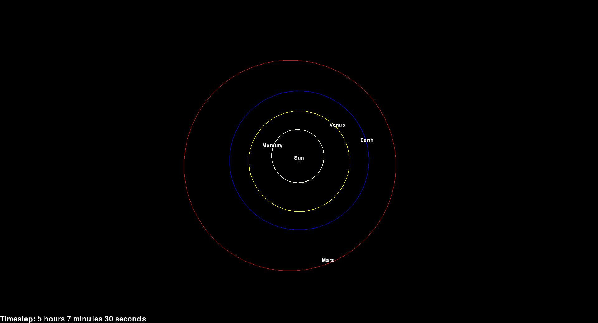
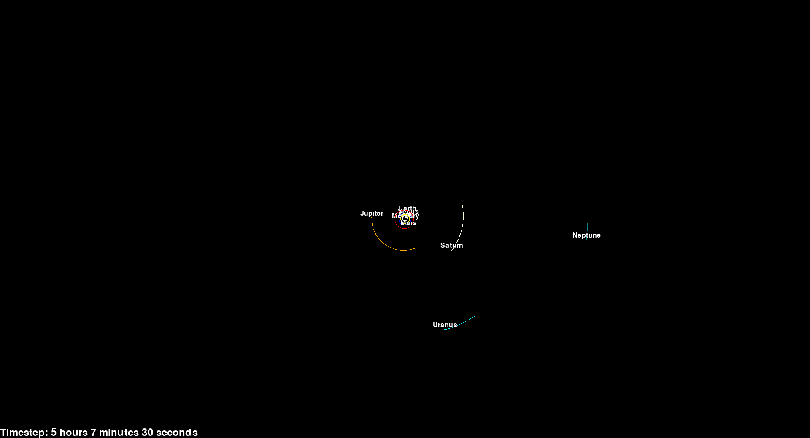

# Astrosim

Astrosim is a hobby project that aims to create a N-body sim that can simulate for example the solar system. The program can request the current positions of the planets (and moons) in the solar system or you can define bodies and their positions and velocities yourself.

